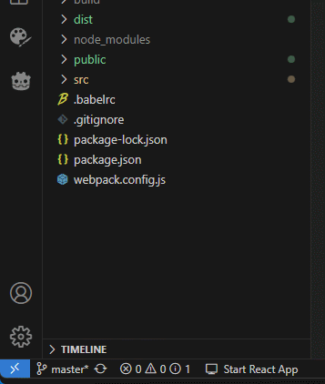

# React Server Control Extension for VSCode

Esta extensión de Visual Studio Code permite iniciar y detener un servidor de desarrollo para aplicaciones React de manera sencilla y rápida. Al detectar la presencia de React en tu proyecto (a través de `package.json`), agrega un elemento en la barra de estado que te permite gestionar el servidor con un solo clic. Soporta los gestores de paquetes `npm`, `yarn` y `pnpm`.

## Características

- **Detección automática**: La extensión busca automáticamente si tu proyecto utiliza React mediante el archivo `package.json`.
- **Compatibilidad con gestores de paquetes**: Puedes usar `npm`, `yarn` o `pnpm` para iniciar tu servidor de desarrollo.
- **Control en la barra de estado**: Muestra un ícono en la barra de estado que indica si el servidor está en ejecución o no.
- **Comandos simples**: Utiliza el comando correspondiente (`npm run start`, `yarn start`, o `pnpm start`) para gestionar el servidor de desarrollo.

## Instalación

1. Abre la paleta de comandos (Ctrl+Shift+P).
2. Escribe `Extensions: Install Extensions`.
3. Busca `React Server Control` y selecciona `Instalar`.

## Uso

1. Abre un proyecto de React.
2. Asegúrate de que `package.json` tenga las dependencias necesarias (React).
3. Haz clic en el ícono en la barra de estado a la izquierda para iniciar o detener el servidor de desarrollo.

## Configuración

La extensión detectará automáticamente el gestor de paquetes que estás utilizando. Asegúrate de tener uno de los siguientes comandos definidos en tu `package.json`:

- Para **npm**: `npm run start`
- Para **yarn**: `yarn start`
- Para **pnpm**: `pnpm start`

## Contribuciones

Si deseas contribuir, no dudes en abrir un issue o enviar un pull request.

## Licencia

Este proyecto está bajo la [Licencia MIT](LICENSE).

